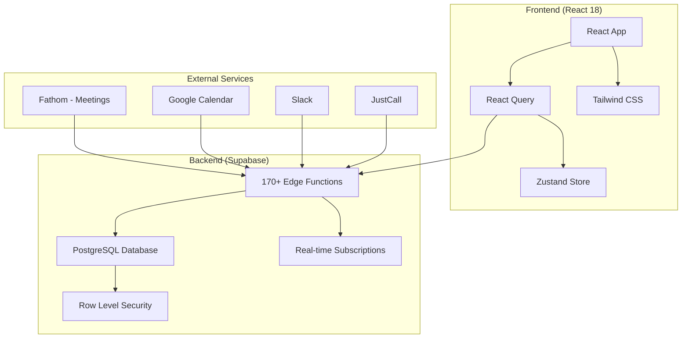
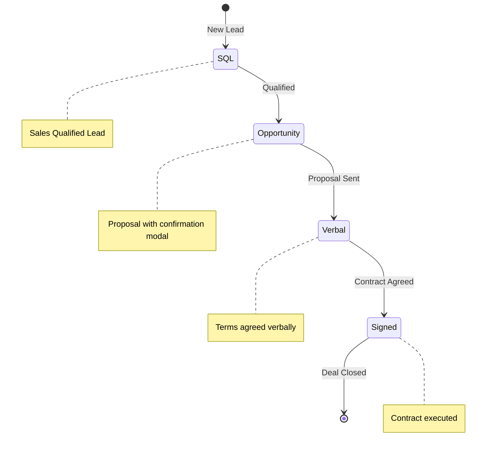
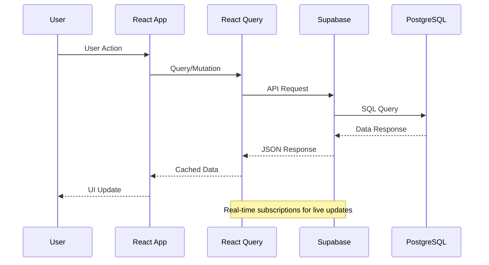

# Sixty Sales Dashboard Documentation

Welcome to the Sixty Sales Dashboard documentation. This guide will help you understand, develop, and deploy the application.

## Quick Navigation

| Section | Description |
|---------|-------------|
| [Getting Started](./getting-started/) | Installation, setup, and first steps |
| [Architecture](./architecture/) | System design and technical decisions |
| [Features](./features/) | Feature-specific documentation |
| [Integrations](./integrations/) | Third-party service integrations |
| [Deployment](./deployment/) | Production deployment guides |
| [Troubleshooting](./troubleshooting/) | Common issues and solutions |
| [API Reference](./api/) | API documentation |

---

## System Overview



---

## 4-Stage Sales Pipeline



---

## Data Flow Architecture



---

## Key Features

### Meeting Intelligence
AI-powered meeting analysis with automatic indexing and semantic search across transcripts.

### Smart Tasks
Automated task generation based on sales activities with configurable templates.

### Admin Security
- Role-based access control with `is_admin` flag
- Revenue split management (admin-only)
- Pipeline protection for split deals
- Comprehensive audit logging

---

## Tech Stack

| Layer | Technology | Purpose |
|-------|------------|---------|
| Frontend | React 18 + TypeScript | UI Components |
| Build | Vite | Fast development & builds |
| Styling | Tailwind CSS | Utility-first CSS |
| Animation | Framer Motion | Smooth transitions |
| State | React Query + Zustand | Data & UI state |
| Backend | Supabase | BaaS platform |
| Database | PostgreSQL | Data storage |
| Functions | Deno Edge Functions | Serverless APIs |
| Hosting | Vercel | Deployment |

---

## Project Structure

```
sixty-sales-dashboard/
├── src/                    # Frontend React application
│   ├── components/         # 138+ React components
│   ├── pages/              # Page components
│   ├── lib/                # Business logic & services
│   └── hooks/              # Custom React hooks
├── supabase/               # Backend infrastructure
│   ├── migrations/         # 411 database migrations
│   └── functions/          # 170+ Edge Functions
├── api/                    # Vercel API routes
├── packages/               # Monorepo packages
│   └── landing/            # Marketing landing pages
├── tests/                  # Test suites
└── docs/                   # This documentation
```

---

## Quick Start

```bash
# Clone and install
git clone [repository-url]
cd sixty-sales-dashboard
npm install

# Configure environment
cp .env.example .env
# Edit .env with Supabase credentials

# Start development
npm run dev
```

See [Getting Started](./getting-started/) for detailed setup instructions.

---

## Performance Metrics

| Metric | Improvement |
|--------|-------------|
| Memory Usage | 64% reduction |
| Component Re-renders | 80% fewer |
| Financial Calculations | 99% faster |
| Cache Hit Rate | 85% |

---

## Documentation Index

- **[Getting Started](./getting-started/)** - Installation and setup
- **[Architecture Overview](./architecture/)** - System design
- **[Feature Guides](./features/)** - Feature documentation
- **[Integration Setup](./integrations/)** - External services
- **[Deployment Guide](./deployment/)** - Production deployment
- **[API Reference](./api/)** - Endpoint documentation
- **[Troubleshooting](./troubleshooting/)** - Common issues
- **[Archive](./archive/)** - Historical documentation

---

## Contributing

See [CONTRIBUTING.md](../CONTRIBUTING.md) for development guidelines and PR process.
