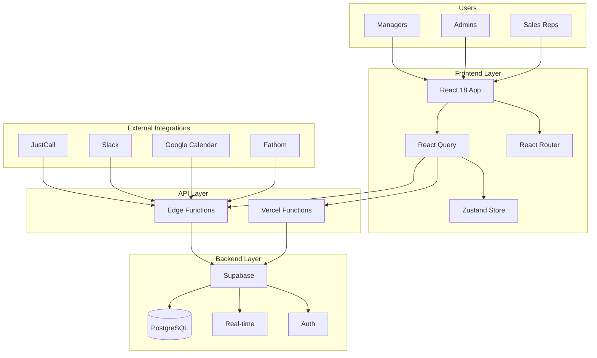
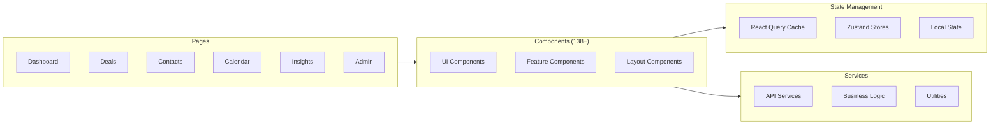
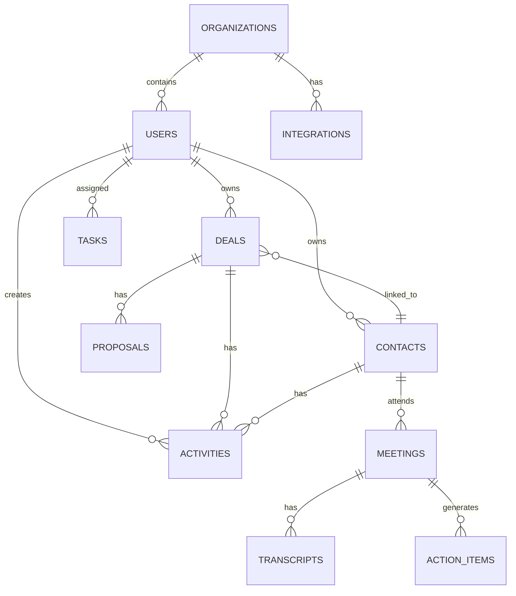
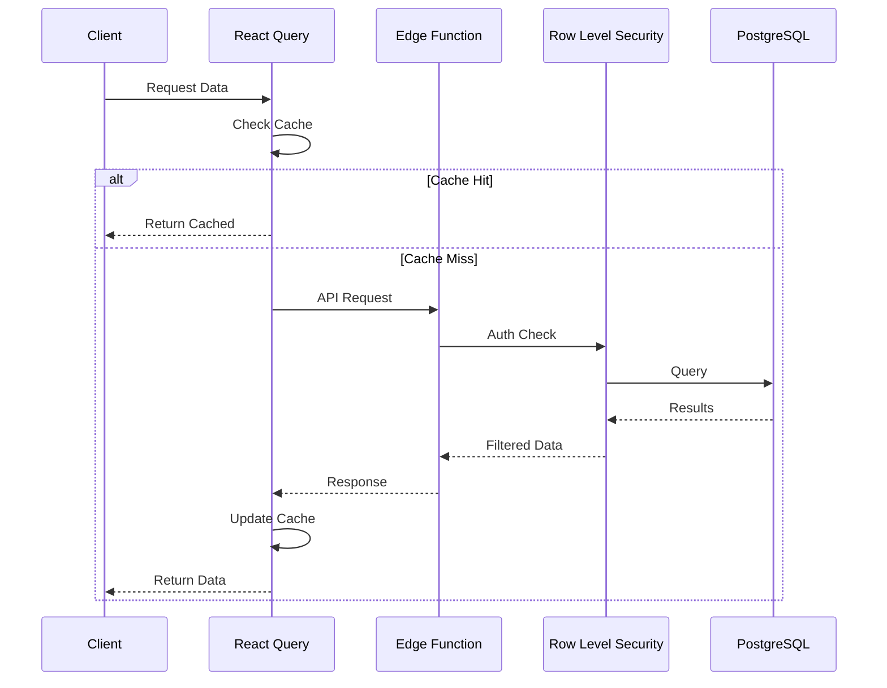
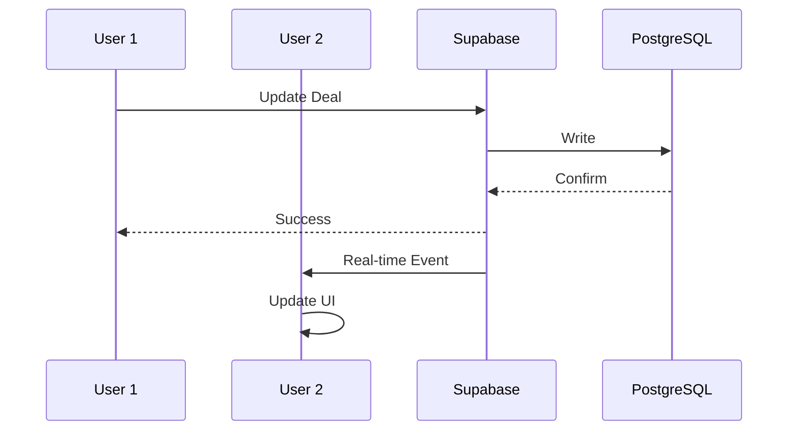
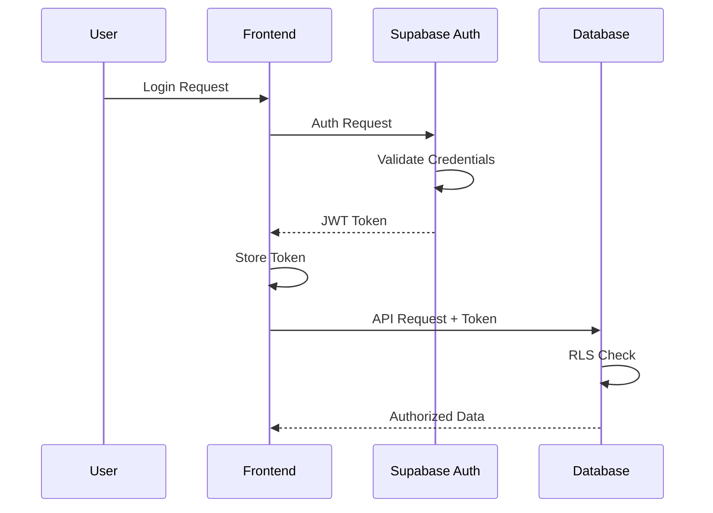
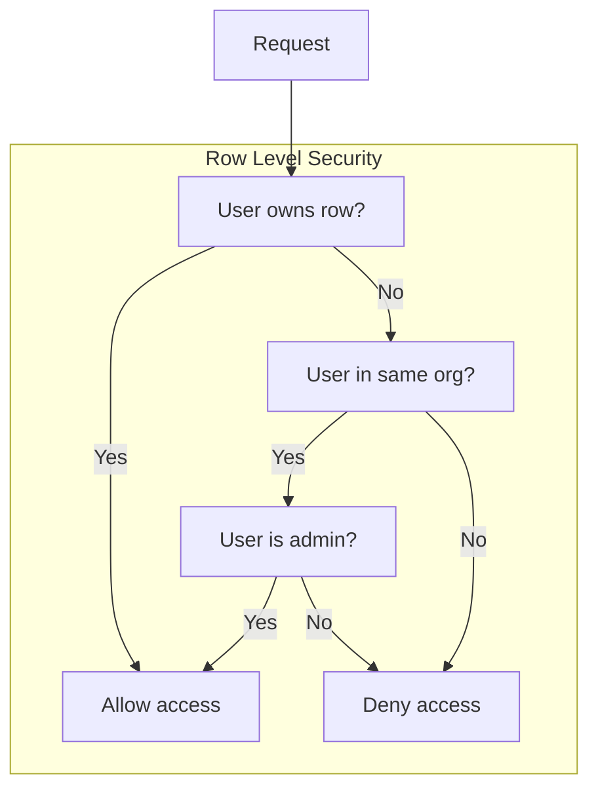
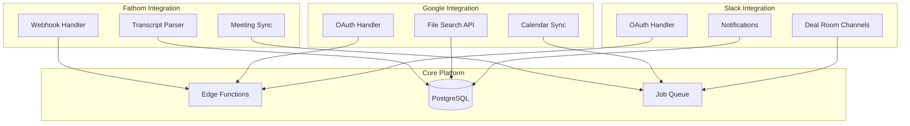
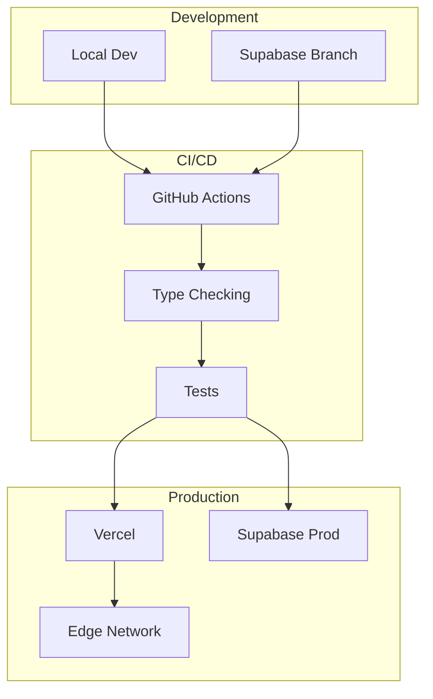

# Architecture Overview

This document provides a comprehensive view of the Sixty Sales Dashboard architecture.

## System Architecture



---

## Component Architecture

### Frontend Structure



### Directory Structure

```
src/
├── components/           # React components
│   ├── admin/            # Admin dashboard
│   ├── CRM/              # CRM features
│   ├── Pipeline/         # Deal pipeline
│   ├── calendar/         # Calendar integration
│   ├── calls/            # Call recording
│   ├── contacts/         # Contact management
│   ├── deals/            # Deal management
│   ├── email/            # Email sync
│   ├── insights/         # Analytics
│   ├── meetings/         # Meeting intelligence
│   ├── settings/         # User settings
│   ├── ui/               # Reusable UI
│   └── workflows/        # Automation
├── pages/                # Page components
├── lib/
│   ├── services/         # Business logic
│   ├── hooks/            # Custom hooks
│   ├── utils/            # Utilities
│   ├── database/         # DB helpers
│   ├── api/              # API clients
│   └── types/            # TypeScript types
└── contexts/             # React contexts
```

---

## Database Architecture

### Entity Relationship



### Key Tables

| Table | Purpose |
|-------|---------|
| `profiles` | User profiles with admin flags |
| `organizations` | Multi-tenant orgs |
| `deals` | Sales deals/opportunities |
| `contacts` | CRM contacts |
| `activities` | Activity log |
| `meetings` | Meeting records |
| `tasks` | Task management |

---

## Data Flow

### Request Flow



### Real-time Updates



---

## Security Architecture

### Authentication Flow



### Row Level Security



---

## Integration Architecture



---

## Deployment Architecture



---

## Technology Decisions

| Decision | Choice | Rationale |
|----------|--------|-----------|
| Frontend | React 18 | Industry standard, hooks, concurrent features |
| Build | Vite | Fast HMR, optimized builds |
| State | React Query | Server state, caching, real-time |
| UI State | Zustand | Simple, lightweight |
| Styling | Tailwind | Utility-first, consistent |
| Backend | Supabase | BaaS, real-time, RLS |
| Database | PostgreSQL | Relational, mature, extensible |
| Hosting | Vercel | Edge network, serverless |
