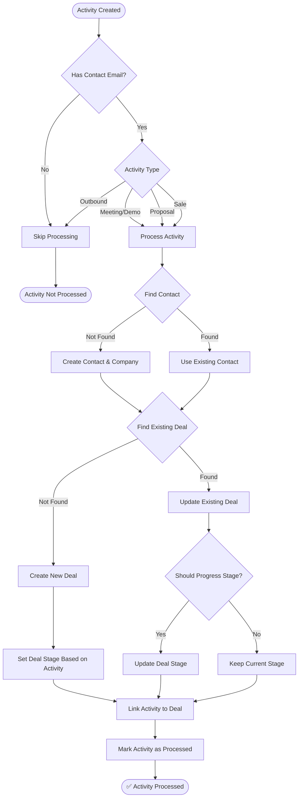

# Automatic Activity Processing Guide

## Overview

The Automatic Activity Processing system eliminates the need for manual "Process" button clicks by automatically creating or updating deals when activities are logged with contact information (email addresses).

## How It Works

### Automatic Processing Flow



### Database Triggers

The system uses PostgreSQL triggers that fire automatically:

1. **ON INSERT**: When a new activity is created with `contact_identifier`
2. **ON UPDATE**: When `contact_identifier` is added to an existing activity

### Activity Type Mapping

| Activity Type | Deal Stage | Action |
|--------------|------------|--------|
| Meeting | SQL | Creates deal in SQL stage |
| Demo | Opportunity | Creates deal in Opportunity stage |
| Proposal | Opportunity | Creates/moves deal to Opportunity |
| Sale | Signed | Creates/moves deal to Signed stage |
| Outbound | N/A | Not processed (intentional) |

## Key Features

### 1. Intelligent Contact Management
- **Automatic Contact Creation**: Creates contacts from email addresses
- **Company Detection**: Extracts company domain from email
- **Contact Linking**: Associates contacts with companies automatically

### 2. Smart Deal Management
- **Duplicate Prevention**: Checks for existing deals before creating new ones
- **Stage Progression**: Automatically moves deals forward based on activity type
- **Value Updates**: Updates deal values from sale activities

### 3. Complete Automation
- **No Manual Intervention**: Processes activities immediately upon creation
- **Bulk Processing**: Handles multiple activities efficiently
- **Error Recovery**: Continues processing even if individual activities fail

## Implementation Details

### Database Schema

```sql
-- Activities table columns used
activities.contact_identifier  -- Email address
activities.is_processed       -- Processing status flag
activities.auto_matched       -- Automatic matching flag
activities.deal_id           -- Linked deal reference
activities.contact_id        -- Linked contact reference
activities.company_id        -- Linked company reference
```

### Processing Function

The `auto_process_activity()` function handles:

1. **Contact Resolution**
   - Searches for existing contact by email
   - Creates new contact if not found
   - Links to company based on email domain

2. **Deal Management**
   - Searches for existing active deal
   - Creates new deal for qualifying activities
   - Updates deal stage based on activity type

3. **Activity Linking**
   - Creates `deal_activities` relationship
   - Marks activity as processed
   - Sets auto_matched flag

### Performance Optimizations

```sql
-- Indexes for fast lookups
idx_activities_contact_identifier
idx_activities_is_processed
idx_activities_type_processed
idx_deal_activities_activity_id
```

## Migration and Setup

### Step 1: Apply Migration

Run the migration file in your Supabase SQL Editor:
```sql
-- File: 20250901_auto_process_activities.sql
-- This creates the function and triggers
```

### Step 2: Verify Installation

Check that the triggers are active:
```sql
-- Check function exists
SELECT proname FROM pg_proc WHERE proname = 'auto_process_activity';

-- Check triggers exist
SELECT tgname FROM pg_trigger WHERE tgname LIKE '%auto_process_activity%';
```

### Step 3: Process Existing Activities

The migration automatically queues existing unprocessed activities for processing.

## Testing

### Test Scenarios

1. **New Activity with Email**
   ```javascript
   // Should automatically create/link deal
   await supabase.from('activities').insert({
     type: 'meeting',
     contact_identifier: 'john@company.com',
     client_name: 'Company Inc'
   });
   ```

2. **Activity Without Email**
   ```javascript
   // Should NOT be processed
   await supabase.from('activities').insert({
     type: 'meeting',
     client_name: 'Company Inc'
     // No contact_identifier
   });
   ```

3. **Outbound Activity**
   ```javascript
   // Should NOT create deal (intentional)
   await supabase.from('activities').insert({
     type: 'outbound',
     contact_identifier: 'prospect@company.com'
   });
   ```

### Verification Steps

1. Create activity with email → Check `is_processed = true`
2. Verify `deal_id` is populated
3. Check deal exists with correct stage
4. Confirm contact was created/linked

## Monitoring

### Key Metrics

```sql
-- Processing rate
SELECT 
  COUNT(*) FILTER (WHERE is_processed = true) AS processed,
  COUNT(*) FILTER (WHERE is_processed = false) AS unprocessed,
  COUNT(*) AS total
FROM activities
WHERE contact_identifier IS NOT NULL;

-- Deal creation rate
SELECT 
  COUNT(DISTINCT deal_id) AS deals_created,
  COUNT(*) AS activities_with_deals
FROM activities
WHERE deal_id IS NOT NULL;

-- Processing success by type
SELECT 
  type,
  COUNT(*) AS total,
  COUNT(*) FILTER (WHERE is_processed = true) AS processed,
  COUNT(*) FILTER (WHERE deal_id IS NOT NULL) AS with_deals
FROM activities
WHERE contact_identifier IS NOT NULL
GROUP BY type;
```

### Activity Processing Dashboard

Use the Activity Processing page to monitor:
- Unprocessed activities queue
- Recently processed activities
- Processing success rates
- Deal linking statistics

## Troubleshooting

### Common Issues

#### Activities Not Being Processed

**Symptoms**: Activities with emails remain `is_processed = false`

**Causes & Solutions**:
1. **Migration not applied**: Run migration in Supabase dashboard
2. **Triggers disabled**: Check trigger status in database
3. **Invalid email format**: Ensure `contact_identifier` contains valid email

#### Duplicate Deals Created

**Symptoms**: Multiple deals for same contact

**Solutions**:
1. System checks for existing active deals first
2. Only creates new deal if none found
3. Review deal matching logic if issues persist

#### Wrong Stage Assignment

**Symptoms**: Deals created in incorrect stage

**Check**:
1. Activity type mapping is correct
2. Deal stages exist in database
3. Stage names match expected values (SQL, Opportunity, Verbal, Signed)

### Manual Processing Fallback

If automatic processing fails, use:
1. **Activity Processing Page**: `/activity-processing` for manual processing
2. **Edge Function**: Call `process-single-activity` directly
3. **SQL Update**: Manually trigger by updating activity

## Integration with Other Systems

### Smart Tasks
- Works alongside Smart Tasks system
- Both triggers can coexist:
  - `create_smart_tasks()` - Creates follow-up tasks
  - `auto_process_activity()` - Processes activities into deals

### QuickAdd Component
- Activities created via QuickAdd are automatically processed
- Manual deal selection still available as override
- Provides immediate feedback on processing status

### Pipeline Management
- Deals created respect 4-stage pipeline (SQL → Opportunity → Verbal → Signed)
- Stage transitions follow business rules
- Activity history maintained for audit trail

## Best Practices

### For Developers

1. **Always Include Email**: Ensure activities have `contact_identifier` for processing
2. **Use Correct Types**: Use standard activity types for proper stage mapping
3. **Handle Errors**: Check `is_processed` flag after creation
4. **Monitor Performance**: Watch for processing delays with high volumes

### For Users

1. **Include Contact Emails**: Always add email addresses to activities
2. **Review Processing**: Check that deals are created/updated correctly
3. **Use Standard Types**: Stick to standard activity types for automation
4. **Report Issues**: Flag any activities that don't process correctly

### For Administrators

1. **Monitor Processing Rates**: Track % of activities being processed
2. **Review Stage Mappings**: Ensure activity types map to correct stages
3. **Audit Deal Creation**: Verify deals are created appropriately
4. **Performance Tuning**: Adjust indexes if processing slows

## Benefits

### Efficiency Gains
- ⏱️ **Time Saved**: No manual processing required
- 🔄 **Real-time**: Activities processed immediately
- 📊 **Accuracy**: Consistent processing rules
- 🎯 **Completeness**: No activities missed

### Data Quality
- 🔗 **Linked Data**: All activities connected to deals
- 📈 **Better Reporting**: Complete activity-deal relationships
- 🎯 **Pipeline Accuracy**: Deals always in correct stage
- 📝 **Audit Trail**: Complete processing history

### User Experience
- ✨ **Seamless**: Works invisibly in background
- 🚀 **Fast**: Immediate processing on creation
- 🎯 **Predictable**: Consistent behavior
- 🔒 **Reliable**: Database-level guarantees

## Future Enhancements

### Planned Features
1. **Configurable Rules**: Admin UI for activity-stage mappings
2. **Batch Processing**: Scheduled processing for high volumes
3. **Smart Matching**: ML-based contact/company matching
4. **Custom Workflows**: Per-team processing rules

### Potential Improvements
1. **Email Parsing**: Extract contact names from email addresses
2. **Company Enrichment**: Auto-fetch company data from domain
3. **Duplicate Merging**: Automatic merge of duplicate contacts/deals
4. **Processing Analytics**: Dashboard for processing metrics

## Summary

The Automatic Activity Processing system transforms the CRM workflow by:

1. **Eliminating Manual Work**: No more clicking "Process" buttons
2. **Ensuring Data Integrity**: All activities properly linked to deals
3. **Improving Pipeline Accuracy**: Deals automatically progress through stages
4. **Saving Time**: Immediate processing without user intervention

This creates a truly smart CRM where activities flow seamlessly into the sales pipeline, ensuring no opportunity is missed and all data is properly connected.