# Bullhorn ATS Integration - Implementation Plan

## Project Overview

**Platform**: use60 - AI-powered post-call admin assistant for recruitment
**Goal**: Automatically push meeting intelligence to Bullhorn, eliminating 2-3 hours of daily ATS admin for recruitment consultants
**Reference Architecture**: Mirror HubSpot integration at `/platform/integrations/roadmap/hubspot`

---

## Status Tracker

```json
{
  "projectName": "Bullhorn ATS Integration",
  "generatedAt": "2025-12-30T00:00:00Z",
  "lastUpdated": "2025-12-30T00:00:00Z",
  "totalPhases": 6,
  "completedPhases": 0,
  "currentPhase": 1,
  "overallProgress": "0%",
  "estimatedTotalDays": 14
}
```

---

## Phase 1: Foundation

**Status**: `pending`
**Estimated Duration**: Days 1-2
**Dependencies**: None

### Objectives
- Establish OAuth 2.0 connection with Bullhorn's two-step auth flow
- Build API client with rate limiting and retry logic
- Set up webhook infrastructure via Subscription API
- Create admin UI for connection management
- Design database schema for sync state

### Tasks

| ID | Layer | Description | Status | Files | Notes |
|----|-------|-------------|--------|-------|-------|
| 1.1 | auth | OAuth 2.0 authorization flow (auth_code → access_token → BhRestToken) | `pending` | `src/integrations/bullhorn/api/auth.ts` | Two-step auth required |
| 1.2 | auth | REST token refresh mechanism (10-min inactivity expiry) | `pending` | `src/integrations/bullhorn/api/auth.ts` | |
| 1.3 | auth | Token storage and retrieval (encrypted) | `pending` | `supabase/migrations/xxx_bullhorn_tokens.sql` | |
| 1.4 | api | Bullhorn API client with rate limiting (100 concurrent calls) | `pending` | `src/integrations/bullhorn/api/client.ts` | |
| 1.5 | api | Exponential backoff and retry logic (429/503 handling) | `pending` | `src/integrations/bullhorn/api/client.ts` | |
| 1.6 | api | Request queue for batch operations | `pending` | `src/integrations/bullhorn/api/client.ts` | |
| 1.7 | webhook | Subscription API endpoint setup | `pending` | `supabase/functions/bullhorn-webhook/index.ts` | |
| 1.8 | webhook | Event subscription (Candidate, ClientContact, JobOrder, Placement) | `pending` | `src/integrations/bullhorn/api/subscriptions.ts` | |
| 1.9 | webhook | Signature verification and idempotent processing | `pending` | `supabase/functions/bullhorn-webhook/index.ts` | |
| 1.10 | ui | Admin connection page (connect/disconnect/re-auth) | `pending` | `src/pages/settings/integrations/BullhornConnection.tsx` | |
| 1.11 | ui | Connection status indicator component | `pending` | `src/components/integrations/BullhornStatus.tsx` | |
| 1.12 | db | Sync state schema (last_synced_at, bullhorn_id mappings) | `pending` | `supabase/migrations/xxx_bullhorn_sync_state.sql` | |
| 1.13 | db | Entity ID mapping table (use60 ↔ Bullhorn) | `pending` | `supabase/migrations/xxx_bullhorn_entity_mappings.sql` | |
| 1.14 | logic | Entity resolver (Candidate vs ClientContact determination) | `pending` | `src/integrations/bullhorn/admin/entity-resolver.ts` | Based on contact type/role |
| 1.15 | types | TypeScript types for Bullhorn entities | `pending` | `src/integrations/bullhorn/types/bullhorn.ts` | |

### Technical Notes

**Bullhorn Auth Flow**:
```
1. OAuth Authorization → auth_code
2. Exchange auth_code → access_token + refresh_token
3. Exchange access_token → BhRestToken (actual API token)
4. BhRestToken expires after 10 mins inactivity → auto-refresh
```

**Base URL Pattern**:
```
https://rest{swimlane}.bullhornstaffing.com/rest-services/{corpToken}/
```

### Definition of Done
- [ ] Can authenticate with Bullhorn via OAuth flow
- [ ] BhRestToken auto-refreshes on expiry
- [ ] API client respects rate limits
- [ ] Webhooks receive and process events
- [ ] Admin can connect/disconnect Bullhorn from settings
- [ ] Entity mappings persist across sessions

---

## Phase 2: Candidate Sync

**Status**: `pending`
**Estimated Duration**: Days 3-5
**Dependencies**: Phase 1 complete

### Objectives
- Implement bi-directional candidate synchronization
- Push meeting summaries as Candidate Notes
- Set up custom fields for use60 intelligence
- Handle candidate search/matching by email

### Tasks

| ID | Layer | Description | Status | Files | Notes |
|----|-------|-------------|--------|-------|-------|
| 2.1 | api | Candidate CRUD operations | `pending` | `src/integrations/bullhorn/api/candidates.ts` | |
| 2.2 | api | Candidate search by email | `pending` | `src/integrations/bullhorn/api/candidates.ts` | `/search/Candidate?query=email:x` |
| 2.3 | sync | Initial candidate match on connect | `pending` | `src/integrations/bullhorn/sync/candidate-sync.ts` | Match existing contacts |
| 2.4 | sync | Bi-directional candidate sync service | `pending` | `src/integrations/bullhorn/sync/candidate-sync.ts` | |
| 2.5 | sync | use60 contact → Bullhorn Candidate push | `pending` | `src/integrations/bullhorn/sync/candidate-sync.ts` | |
| 2.6 | sync | Bullhorn Candidate → use60 contact pull | `pending` | `src/integrations/bullhorn/sync/candidate-sync.ts` | Via webhook events |
| 2.7 | api | Note creation (linked to Candidate) | `pending` | `src/integrations/bullhorn/api/notes.ts` | |
| 2.8 | sync | Meeting summary → Candidate Note push | `pending` | `src/integrations/bullhorn/sync/intelligence-sync.ts` | Post-call automation |
| 2.9 | api | Custom field setup/retrieval | `pending` | `src/integrations/bullhorn/api/custom-fields.ts` | |
| 2.10 | sync | Intelligence field writeback (availability, salary, intent) | `pending` | `src/integrations/bullhorn/sync/intelligence-sync.ts` | |
| 2.11 | sync | Candidate status/availability update | `pending` | `src/integrations/bullhorn/sync/candidate-sync.ts` | From call intelligence |
| 2.12 | ui | Candidate sync status in contact detail | `pending` | `src/components/contacts/BullhornSyncBadge.tsx` | |
| 2.13 | webhook | Candidate.created event handler | `pending` | `supabase/functions/bullhorn-webhook/handlers/candidate.ts` | |
| 2.14 | webhook | Candidate.updated event handler | `pending` | `supabase/functions/bullhorn-webhook/handlers/candidate.ts` | |

### Data Mapping

**Candidate Call Intelligence Writeback**:
| use60 Field | Bullhorn Field | Type |
|-------------|----------------|------|
| Availability | customText1 (or status) | Text |
| Notice Period | customText2 | Text |
| Salary Expectation | salary / customFloat1 | Number |
| Skills Notes | skillSet + Note | Text |
| Job Interest Level | customText3 | hot/warm/cold |
| Interview Feedback | Note (with action type) | Text |
| Objections/Concerns | Note | Text |

### Definition of Done
- [ ] Existing candidates matched on connect by email
- [ ] New candidates sync bi-directionally
- [ ] Meeting summaries appear as Candidate Notes within 60s
- [ ] Custom fields populated with AI intelligence
- [ ] Candidate updates in Bullhorn reflect in use60

---

## Phase 3: Client & Job Sync

**Status**: `pending`
**Estimated Duration**: Days 6-8
**Dependencies**: Phase 2 complete

### Objectives
- Sync ClientContact records (hiring managers)
- Associate with ClientCorporation
- Sync JobOrder as deals/opportunities
- Push client meeting intelligence

### Tasks

| ID | Layer | Description | Status | Files | Notes |
|----|-------|-------------|--------|-------|-------|
| 3.1 | api | ClientContact CRUD operations | `pending` | `src/integrations/bullhorn/api/client-contacts.ts` | |
| 3.2 | api | ClientContact search by email | `pending` | `src/integrations/bullhorn/api/client-contacts.ts` | |
| 3.3 | api | ClientCorporation association | `pending` | `src/integrations/bullhorn/api/client-contacts.ts` | |
| 3.4 | sync | ClientContact bi-directional sync | `pending` | `src/integrations/bullhorn/sync/client-sync.ts` | |
| 3.5 | sync | use60 contact (client type) → ClientContact | `pending` | `src/integrations/bullhorn/sync/client-sync.ts` | |
| 3.6 | api | JobOrder CRUD operations | `pending` | `src/integrations/bullhorn/api/job-orders.ts` | |
| 3.7 | sync | JobOrder ↔ Deal/Opportunity sync | `pending` | `src/integrations/bullhorn/sync/job-sync.ts` | |
| 3.8 | sync | Meeting → ClientContact Note push | `pending` | `src/integrations/bullhorn/sync/intelligence-sync.ts` | |
| 3.9 | sync | Meeting → JobOrder Note push | `pending` | `src/integrations/bullhorn/sync/intelligence-sync.ts` | |
| 3.10 | sync | Job requirement intelligence writeback | `pending` | `src/integrations/bullhorn/sync/intelligence-sync.ts` | |
| 3.11 | webhook | ClientContact.updated event handler | `pending` | `supabase/functions/bullhorn-webhook/handlers/client-contact.ts` | |
| 3.12 | webhook | JobOrder.updated event handler | `pending` | `supabase/functions/bullhorn-webhook/handlers/job-order.ts` | |
| 3.13 | ui | Job sync status in deal detail | `pending` | `src/components/deals/BullhornJobBadge.tsx` | |

### Data Mapping

**Client Call Intelligence Writeback**:
| use60 Intelligence | Bullhorn Target | Notes |
|--------------------|-----------------|-------|
| Job requirement changes | JobOrder.description + Note | Must-haves, nice-to-haves |
| Hiring timeline | JobOrder.startDate / customDate1 | |
| Budget/rate card | JobOrder.salary + payRate | |
| Competitor intelligence | ClientContact Note | |
| Decision-maker mapping | ClientContact + Note | |
| Meeting attendee notes | ClientContact Note | |

### Definition of Done
- [ ] Client contacts sync bi-directionally
- [ ] JobOrders appear as deals in use60
- [ ] Client meeting summaries push to ClientContact/JobOrder
- [ ] Job requirement updates reflect in Bullhorn
- [ ] Hiring timeline changes sync automatically

---

## Phase 4: Tasks & Advanced Features

**Status**: `pending`
**Estimated Duration**: Days 9-10
**Dependencies**: Phase 3 complete

### Objectives
- Sync action items as Bullhorn Tasks
- Track Sendout/Submission records
- Pull Placement status
- Implement bulk operations with rate limiting

### Tasks

| ID | Layer | Description | Status | Files | Notes |
|----|-------|-------------|--------|-------|-------|
| 4.1 | api | Task CRUD operations | `pending` | `src/integrations/bullhorn/api/tasks.ts` | |
| 4.2 | sync | Action items → Bullhorn Tasks push | `pending` | `src/integrations/bullhorn/sync/task-sync.ts` | use60_task_id custom field |
| 4.3 | sync | Task completion bi-directional sync | `pending` | `src/integrations/bullhorn/sync/task-sync.ts` | |
| 4.4 | api | Sendout/Submission operations | `pending` | `src/integrations/bullhorn/api/sendouts.ts` | Interview tracking |
| 4.5 | sync | Interview debrief → Sendout Note | `pending` | `src/integrations/bullhorn/sync/intelligence-sync.ts` | |
| 4.6 | api | Placement read operations | `pending` | `src/integrations/bullhorn/api/placements.ts` | |
| 4.7 | sync | Placement status pull | `pending` | `src/integrations/bullhorn/sync/placement-sync.ts` | |
| 4.8 | webhook | Placement.created event handler | `pending` | `supabase/functions/bullhorn-webhook/handlers/placement.ts` | |
| 4.9 | api | Bulk entity operations (/entity/Candidate/ids) | `pending` | `src/integrations/bullhorn/api/bulk.ts` | |
| 4.10 | sync | Bulk sync orchestration | `pending` | `src/integrations/bullhorn/sync/sync-service.ts` | Initial connect sync |
| 4.11 | ui | Full sync progress indicator | `pending` | `src/components/integrations/BullhornSyncProgress.tsx` | |
| 4.12 | logic | Conflict resolution for bi-directional sync | `pending` | `src/integrations/bullhorn/sync/conflict-resolver.ts` | Last-write-wins or merge |

### Interview Debrief Intelligence

| use60 Intelligence | Bullhorn Target | Notes |
|--------------------|-----------------|-------|
| Candidate performance | Sendout Note + Candidate Note | |
| Client feedback | ClientContact Note + Sendout | |
| Next stage progression | Sendout.status | |
| Offer likelihood score | Candidate customFloat + Note | |

### Definition of Done
- [ ] Action items appear as Bullhorn Tasks
- [ ] Task completion syncs both directions
- [ ] Sendout records track interview stages
- [ ] Placement creates trigger in use60
- [ ] Bulk operations respect rate limits
- [ ] Disconnecting preserves data in both systems

---

## Phase 5: Process Map Integration

**Status**: `pending`
**Estimated Duration**: Days 11-12
**Dependencies**: Phase 4 complete

### Objectives
- Add Bullhorn to the Process Maps admin page
- Generate AI-powered visualization of Bullhorn integration flow
- Enable workflow testing for Bullhorn sync processes
- Provide visual documentation for recruitment teams

### Tasks

| ID | Layer | Description | Status | Files | Notes |
|----|-------|-------------|--------|-------|-------|
| 5.1 | ui | Add Bullhorn to AVAILABLE_PROCESSES array | `pending` | `src/pages/admin/ProcessMaps.tsx` | Integration type with recruitment icon |
| 5.2 | ui | Add Bullhorn-specific icon and styling | `pending` | `src/pages/admin/ProcessMaps.tsx` | Match existing integration patterns |
| 5.3 | edge | Create Bullhorn process map generator prompt | `pending` | `supabase/functions/generate-process-map/prompts/bullhorn.ts` | Recruitment-specific flow |
| 5.4 | edge | Define Bullhorn process structure schema | `pending` | `supabase/functions/generate-process-map/schemas/bullhorn.ts` | Steps for OAuth, sync, webhooks |
| 5.5 | logic | Implement Bullhorn-specific step handlers | `pending` | `src/lib/types/processMapTesting.ts` | Test step definitions |
| 5.6 | ui | Add Bullhorn process map test scenarios | `pending` | `src/components/process-maps/WorkflowTestPanel.tsx` | OAuth, sync, webhook tests |
| 5.7 | ui | Create Bullhorn integration diagram (horizontal) | `pending` | Generated via edge function | Candidate ↔ ClientContact flow |
| 5.8 | ui | Create Bullhorn integration diagram (vertical) | `pending` | Generated via edge function | Alternative layout |
| 5.9 | docs | Document Bullhorn process map structure | `pending` | `docs/integrations/bullhorn-process-map.md` | For internal reference |

### Process Map Structure

**Bullhorn Integration Flow Steps**:
1. **OAuth Authorization** → User initiates Bullhorn connection
2. **Token Exchange** → auth_code → access_token → BhRestToken
3. **Entity Resolution** → Determine Candidate vs ClientContact mapping
4. **Initial Sync** → Bulk fetch existing records
5. **Webhook Registration** → Subscribe to Bullhorn events
6. **Meeting Trigger** → Post-call processing activates
7. **Intelligence Extraction** → AI extracts candidate/client insights
8. **Entity Update** → Push notes, custom fields to Bullhorn
9. **Task Creation** → Action items → Bullhorn Tasks
10. **Bi-directional Sync** → Webhook events update use60

### Mermaid Diagram Template

```mermaid
flowchart LR
    subgraph Auth["🔐 Authentication"]
        A1[OAuth Initiate] --> A2[Auth Code]
        A2 --> A3[Access Token]
        A3 --> A4[BhRestToken]
    end

    subgraph Sync["🔄 Sync Engine"]
        S1[Entity Resolver] --> S2{Candidate?}
        S2 -->|Yes| S3[Candidate Sync]
        S2 -->|No| S4[ClientContact Sync]
        S3 --> S5[JobOrder Sync]
        S4 --> S5
    end

    subgraph Intel["🧠 Intelligence"]
        I1[Meeting Processed] --> I2[Extract Insights]
        I2 --> I3[Push Notes]
        I2 --> I4[Update Fields]
        I2 --> I5[Create Tasks]
    end

    Auth --> Sync
    Sync --> Intel
```



### Definition of Done
- [ ] Bullhorn appears in Process Maps page with correct icon
- [ ] Process map generates successfully via AI
- [ ] Horizontal and vertical views render correctly
- [ ] Test panel shows Bullhorn-specific test scenarios
- [ ] Documentation describes integration flow accurately

---

## Phase 6: Test Suite

**Status**: `pending`
**Estimated Duration**: Days 13-14
**Dependencies**: Phases 1-4 complete (can run in parallel with Phase 5)

### Objectives
- Create comprehensive unit tests mirroring HubSpot test patterns
- Cover API client, webhook validation, sync handlers, and queue worker
- Ensure >80% code coverage for Bullhorn integration
- Validate rate limiting and error handling

### Tasks

| ID | Layer | Description | Status | Files | Notes |
|----|-------|-------------|--------|-------|-------|
| 6.1 | test | BullhornClient unit tests (retry, backoff, URL) | `pending` | `tests/unit/bullhorn/bullhornClient.test.ts` | Mirror hubspotClient.test.ts |
| 6.2 | test | Webhook signature verification tests | `pending` | `tests/unit/bullhorn/webhookValidation.test.ts` | Bullhorn uses different sig format |
| 6.3 | test | Sync handler tests (Candidate mapping) | `pending` | `tests/unit/bullhorn/syncHandlers.test.ts` | Email normalization, field mapping |
| 6.4 | test | Sync handler tests (ClientContact mapping) | `pending` | `tests/unit/bullhorn/syncHandlers.test.ts` | Entity type resolution |
| 6.5 | test | Sync handler tests (JobOrder mapping) | `pending` | `tests/unit/bullhorn/syncHandlers.test.ts` | Deal ↔ JobOrder conversion |
| 6.6 | test | Sync handler tests (Task mapping) | `pending` | `tests/unit/bullhorn/syncHandlers.test.ts` | Task status mapping |
| 6.7 | test | Queue worker tests | `pending` | `tests/unit/bullhorn/queueWorker.test.ts` | Job processing, retry logic |
| 6.8 | test | Integration logic tests | `pending` | `tests/unit/bullhorn/integrationLogic.test.ts` | End-to-end sync scenarios |
| 6.9 | test | Feature flag tests | `pending` | `tests/unit/featureFlags/bullhornIntegrationFlag.test.ts` | VITE_BULLHORN_INTEGRATION_ENABLED |
| 6.10 | test | LWW conflict resolution tests | `pending` | `tests/unit/bullhorn/syncHandlers.test.ts` | Last-write-wins logic |
| 6.11 | test | Entity resolver tests | `pending` | `tests/unit/bullhorn/entityResolver.test.ts` | Candidate vs ClientContact |
| 6.12 | test | Token refresh tests | `pending` | `tests/unit/bullhorn/bullhornClient.test.ts` | BhRestToken expiry handling |
| 6.13 | test | Rate limiting tests | `pending` | `tests/unit/bullhorn/bullhornClient.test.ts` | 100 concurrent call limit |
| 6.14 | ci | Add Bullhorn tests to CI pipeline | `pending` | `.github/workflows/test.yml` | Run on PR |

### Test Categories (Mirroring HubSpot)

**1. bullhornClient.test.ts** - API Client Tests
```typescript
describe('BullhornClient', () => {
  describe('REST Token Management', () => {
    it('should exchange access_token for BhRestToken')
    it('should refresh BhRestToken after 10 min inactivity')
    it('should handle 401 with automatic token refresh')
  })

  describe('Retry-After Header Parsing', () => {
    it('should parse numeric Retry-After header')
    it('should return undefined for missing header')
  })

  describe('Error Classification', () => {
    it('should classify 429 as retryable')
    it('should classify 5xx as retryable')
    it('should classify 4xx (except 429) as non-retryable')
  })

  describe('Exponential Backoff', () => {
    it('should calculate backoff with base 1000ms')
    it('should cap backoff at 30 seconds')
  })

  describe('URL Construction', () => {
    it('should build URL with swimlane and corpToken')
    it('should handle query parameters correctly')
  })
})
```

**2. webhookValidation.test.ts** - Webhook Tests
```typescript
describe('Bullhorn Webhook Validation', () => {
  describe('Subscription Verification', () => {
    it('should verify valid subscription callback')
    it('should reject invalid subscription tokens')
  })

  describe('Event Parsing', () => {
    it('should parse Candidate.created events')
    it('should parse ClientContact.updated events')
    it('should parse JobOrder.updated events')
    it('should parse Placement.created events')
  })

  describe('Job Type Mapping', () => {
    it('should map Candidate events to sync_candidate job')
    it('should map ClientContact events to sync_client_contact job')
    it('should map JobOrder events to sync_job_order job')
  })

  describe('Idempotency', () => {
    it('should deduplicate events by eventId')
    it('should process events in order')
  })
})
```

**3. syncHandlers.test.ts** - Sync Logic Tests
```typescript
describe('Bullhorn Sync Handlers', () => {
  describe('Candidate Sync', () => {
    it('should map Bullhorn Candidate to use60 contact')
    it('should map use60 contact to Bullhorn Candidate')
    it('should handle email normalization')
    it('should handle missing optional fields')
  })

  describe('ClientContact Sync', () => {
    it('should map ClientContact to use60 contact (client type)')
    it('should associate with ClientCorporation')
  })

  describe('JobOrder Sync', () => {
    it('should map JobOrder to use60 deal')
    it('should convert salary to deal value')
    it('should map status to deal stage')
  })

  describe('Task Sync', () => {
    it('should map use60 task to Bullhorn Task')
    it('should map completion status correctly')
  })

  describe('Note Creation', () => {
    it('should create Note with personReference')
    it('should associate Note with JobOrder')
    it('should set correct action type')
  })

  describe('Entity Resolution', () => {
    it('should resolve candidate contacts correctly')
    it('should resolve client contacts correctly')
    it('should handle ambiguous contacts')
  })

  describe('LWW Conflict Resolution', () => {
    it('should skip update if local is newer')
    it('should apply update if Bullhorn is newer')
    it('should handle missing timestamps')
  })
})
```

**4. Feature Flag Tests**
```typescript
describe('isBullhornIntegrationEnabled', () => {
  it('returns false when flag not set')
  it('returns true when VITE_BULLHORN_INTEGRATION_ENABLED=true')
})
```

### Test File Structure

```
tests/unit/bullhorn/
├── bullhornClient.test.ts      # API client, auth, rate limiting
├── webhookValidation.test.ts   # Webhook signature, event parsing
├── syncHandlers.test.ts        # Entity mapping, conflict resolution
├── queueWorker.test.ts         # Job processing, retry logic
├── integrationLogic.test.ts    # End-to-end scenarios
└── entityResolver.test.ts      # Candidate vs ClientContact logic

tests/unit/featureFlags/
└── bullhornIntegrationFlag.test.ts
```

### Coverage Targets

| Module | Target | Focus Areas |
|--------|--------|-------------|
| `api/client.ts` | >85% | Token refresh, rate limiting, retries |
| `api/auth.ts` | >90% | OAuth flow, BhRestToken exchange |
| `sync/*.ts` | >80% | Entity mapping, conflict resolution |
| `admin/entity-resolver.ts` | >90% | Type determination logic |
| Webhook handlers | >85% | Event parsing, idempotency |

### Definition of Done
- [ ] All test files created matching HubSpot patterns
- [ ] >80% code coverage for integration module
- [ ] All tests pass in CI pipeline
- [ ] Rate limiting edge cases covered
- [ ] Token refresh scenarios tested
- [ ] Entity resolution edge cases covered
- [ ] Feature flag tests pass

---

## File Structure

```
src/integrations/bullhorn/
├── api/
│   ├── client.ts              # API client with auth & rate limiting
│   ├── auth.ts                # OAuth + REST token management
│   ├── candidates.ts          # Candidate CRUD operations
│   ├── client-contacts.ts     # ClientContact operations
│   ├── job-orders.ts          # JobOrder operations
│   ├── notes.ts               # Note creation (linked to entities)
│   ├── tasks.ts               # Task CRUD operations
│   ├── placements.ts          # Placement read operations
│   ├── sendouts.ts            # Sendout/Submission operations
│   ├── subscriptions.ts       # Webhook subscription management
│   ├── custom-fields.ts       # Custom field operations
│   └── bulk.ts                # Bulk entity operations
├── sync/
│   ├── sync-service.ts        # Main sync orchestration
│   ├── candidate-sync.ts      # Candidate sync logic
│   ├── client-sync.ts         # ClientContact sync logic
│   ├── job-sync.ts            # JobOrder sync logic
│   ├── task-sync.ts           # Task sync logic
│   ├── placement-sync.ts      # Placement sync logic
│   ├── intelligence-sync.ts   # AI writeback logic
│   └── conflict-resolver.ts   # Bi-directional conflict handling
├── admin/
│   ├── connection.ts          # OAuth flow & connection management
│   ├── mapping.ts             # Field mapping configuration
│   └── entity-resolver.ts     # Candidate vs ClientContact resolution
├── types/
│   └── bullhorn.ts            # TypeScript types for Bullhorn entities
└── index.ts                   # Public API exports

supabase/
├── functions/
│   ├── bullhorn-webhook/
│   │   ├── index.ts           # Webhook entry point
│   │   └── handlers/
│   │       ├── candidate.ts
│   │       ├── client-contact.ts
│   │       ├── job-order.ts
│   │       └── placement.ts
│   └── generate-process-map/
│       ├── prompts/
│       │   └── bullhorn.ts    # Bullhorn-specific AI prompt
│       └── schemas/
│           └── bullhorn.ts    # Process structure schema
└── migrations/
    ├── xxx_bullhorn_tokens.sql
    ├── xxx_bullhorn_sync_state.sql
    └── xxx_bullhorn_entity_mappings.sql

tests/unit/
├── bullhorn/
│   ├── bullhornClient.test.ts      # API client, auth, rate limiting
│   ├── webhookValidation.test.ts   # Webhook signature, event parsing
│   ├── syncHandlers.test.ts        # Entity mapping, conflict resolution
│   ├── queueWorker.test.ts         # Job processing, retry logic
│   ├── integrationLogic.test.ts    # End-to-end scenarios
│   └── entityResolver.test.ts      # Candidate vs ClientContact logic
└── featureFlags/
    └── bullhornIntegrationFlag.test.ts
```

---

## API Reference

### Base URL Pattern
```
https://rest{swimlane}.bullhornstaffing.com/rest-services/{corpToken}/
```

### Key Endpoints

```typescript
// Candidates
POST   /entity/Candidate                    // Create candidate
GET    /entity/Candidate/{id}               // Get candidate
POST   /entity/Candidate/{id}               // Update candidate (POST for updates)
GET    /search/Candidate?query=email:x      // Search by email
GET    /entity/Candidate/{id1},{id2},...    // Bulk get by IDs

// Client Contacts
POST   /entity/ClientContact                // Create client contact
GET    /entity/ClientContact/{id}           // Get client contact
POST   /entity/ClientContact/{id}           // Update client contact
GET    /search/ClientContact?query=email:x  // Search by email

// Notes
POST   /entity/Note                         // Create note (linked to entity)

// Job Orders
GET    /entity/JobOrder/{id}                // Get job order
POST   /entity/JobOrder/{id}                // Update job order

// Tasks
POST   /entity/Task                         // Create task
GET    /entity/Task/{id}                    // Get task
POST   /entity/Task/{id}                    // Update task

// Placements
GET    /entity/Placement/{id}               // Get placement

// Subscriptions (Webhooks)
POST   /event/subscription                  // Subscribe to events
DELETE /event/subscription/{id}             // Unsubscribe
GET    /event/subscription/{id}/events      // Poll for events (alternative)
```

### Note Entity Association Example

```json
{
  "action": "Candidate Call Summary",
  "comments": "AI-generated meeting summary...",
  "personReference": { "id": 12345 },
  "jobOrder": { "id": 67890 }
}
```

---

## Success Criteria

| Criteria | Target | Measurement |
|----------|--------|-------------|
| Connect Bullhorn account | < 2 minutes | Time from click to connected |
| Post-call Candidate Note | < 60 seconds | Time from call end to Note visible |
| Client meeting → JobOrder update | < 60 seconds | Time from call end to update |
| Action items → Bullhorn Tasks | Automatic | No manual intervention |
| Custom field population | Automatic | AI intelligence fields filled |
| Bi-directional sync | Real-time | Changes reflected in both systems |
| Rate limit compliance | 100% | No 429/503 errors in production |
| Data preservation on disconnect | 100% | No data loss in either system |
| Process map generation | < 30 seconds | AI diagram generation time |
| Process map test pass rate | 100% | All workflow steps testable |
| Unit test coverage | > 80% | Code coverage for integration module |
| CI pipeline tests | 100% pass | All Bullhorn tests in PR checks |

---

## Log

### 2025-12-30
- **Created**: Initial implementation plan document (Phases 1-4)
- **Added**: Phase 5 - Process Map Integration (9 tasks)
- **Added**: Phase 6 - Test Suite (14 tasks, mirroring HubSpot patterns)
- **Updated**: Total phases 4 → 6, estimated days 10 → 14
- **Status**: Ready to begin Phase 1

---

## Notes

### Bullhorn Auth Complexity
Bullhorn uses a more complex auth flow than HubSpot:
1. Standard OAuth to get `auth_code`
2. Exchange for `access_token` + `refresh_token`
3. Must exchange `access_token` for `BhRestToken` (the actual API token)
4. `BhRestToken` expires after 10 minutes of **inactivity** (not fixed time)
5. Need to refresh proactively or handle 401s gracefully

### Entity Resolution Challenge
Unlike HubSpot where contacts are unified, Bullhorn separates:
- **Candidate**: Job seekers
- **ClientContact**: Hiring managers, client stakeholders

The entity resolver must determine which type a use60 contact maps to based on:
- Contact type/role field in use60
- Meeting context (candidate call vs client call)
- Existing Bullhorn mappings

### Webhook vs Polling
Bullhorn supports both:
- **Subscription API**: Push-based webhooks (preferred)
- **Event polling**: Pull-based via `GET /event/subscription/{id}/events`

Implement webhooks as primary, polling as fallback for reliability.
