# QuickAdd and Pipeline Management Flowcharts

## QuickAdd Functions - Duplicate Prevention & Smart Deal Management

```mermaid
flowchart TD
    Start([User Opens QuickAdd]) --> SelectAction{Select Action Type}
    
    SelectAction --> Task[Create Task]
    SelectAction --> Deal[Create Deal]
    SelectAction --> Sales[Log Sales Activity]
    SelectAction --> Outbound[Log Outbound Activity]
    SelectAction --> Meeting[Schedule Meeting]
    SelectAction --> Proposal[Submit Proposal]
    
    %% Task Flow
    Task --> TaskForm[Fill Task Details]
    TaskForm --> TaskDeal{Link to Deal?}
    TaskDeal -->|Yes| SelectExistingDeal1[Select from Existing Deals]
    TaskDeal -->|No| CreateTaskOnly[Create Standalone Task]
    SelectExistingDeal1 --> SaveTask[Save Task]
    CreateTaskOnly --> SaveTask
    
    %% Deal Flow with Duplicate Prevention
    Deal --> DealForm[Fill Deal Details]
    DealForm --> CheckDuplicate{Check for Existing Deal<br/>Same Client + Stage?}
    CheckDuplicate -->|Exists| ShowWarning[⚠️ Show Duplicate Warning]
    ShowWarning --> UserChoice{User Decision}
    UserChoice -->|Update Existing| UpdateDeal[Update Existing Deal Value/Info]
    UserChoice -->|Create New| CreateNewDeal[Create New Deal<br/>Different Product/Service]
    CheckDuplicate -->|No Duplicate| CreateNewDeal
    UpdateDeal --> SaveDeal[Save Deal]
    CreateNewDeal --> SaveDeal
    
    %% Sales Activity Flow
    Sales --> SalesForm[Log Sales Activity]
    SalesForm --> LinkDeal1{Link to Deal?}
    LinkDeal1 -->|Yes| SelectDeal1[Select Existing Deal]
    LinkDeal1 -->|Create New| QuickDealCreate1[Quick Deal Creation]
    SelectDeal1 --> CheckStage1{Check Deal Stage}
    QuickDealCreate1 --> CheckStage1
    CheckStage1 -->|Lead/Opportunity| StayStage1[Keep Current Stage]
    CheckStage1 -->|Other| SuggestProgress1[📈 Suggest Stage Progress]
    StayStage1 --> SaveSales[Save Activity]
    SuggestProgress1 --> SaveSales
    
    %% Outbound Activity Flow
    Outbound --> OutboundForm[Log Outbound Activity]
    OutboundForm --> LinkDeal2{Link to Deal?}
    LinkDeal2 -->|Yes| SelectDeal2[Select Existing Deal]
    LinkDeal2 -->|Create New| QuickDealCreate2[Quick Deal Creation]
    SelectDeal2 --> SaveOutbound[Save Activity]
    QuickDealCreate2 --> SaveOutbound
    
    %% Meeting Flow
    Meeting --> MeetingForm[Schedule Meeting]
    MeetingForm --> LinkDeal3{Link to Deal?}
    LinkDeal3 -->|Yes| SelectDeal3[Select Existing Deal]
    LinkDeal3 -->|Create New| QuickDealCreate3[Quick Deal Creation]
    SelectDeal3 --> CheckStage2{Check Deal Stage}
    QuickDealCreate3 --> CheckStage2
    CheckStage2 -->|SQL| StaySQL[Keep in SQL]
    CheckStage2 -->|Other| StayStage2[Keep Current Stage]
    StaySQL --> SaveMeeting[Save Meeting]
    StayStage2 --> SaveMeeting
    
    %% Proposal Flow
    Proposal --> ProposalForm[Submit Proposal]
    ProposalForm --> LinkDeal4{Link to Deal?}
    LinkDeal4 -->|Yes| SelectDeal4[Select Existing Deal]
    LinkDeal4 -->|Create New| QuickDealCreate4[Quick Deal Creation]
    SelectDeal4 --> CheckStage3{Check Deal Stage}
    QuickDealCreate4 --> CheckStage3
    CheckStage3 -->|SQL| ProgressProposal[✅ Auto-Progress to Opportunity]
    CheckStage3 -->|Opportunity| StayStage3[Keep in Opportunity]
    CheckStage3 -->|Other| StayStage3
    ProgressProposal --> SaveProposal[Save Proposal]
    StayStage3 --> SaveProposal
    
    %% Final Steps
    SaveTask --> Success([✅ Success + Update UI])
    SaveDeal --> Success
    SaveSales --> Success
    SaveOutbound --> Success
    SaveMeeting --> Success
    SaveProposal --> Success
    
    %% Styling
    classDef warning fill:#ff9800,stroke:#f57c00,color:#fff
    classDef success fill:#4caf50,stroke:#388e3c,color:#fff
    classDef info fill:#2196f3,stroke:#1976d2,color:#fff
    class ShowWarning warning
    class Success,ProgressOpp,ProgressProposal success
    class CheckDuplicate,CheckStage1,CheckStage2,CheckStage3 info
```



## Pipeline Drag & Drop - Deal Movement with Activity Tracking

```mermaid
flowchart TD
    Start([User Drags Deal Card]) --> ValidateMove{Valid Stage Transition?}
    
    ValidateMove -->|Invalid| RejectMove[❌ Return to Original Position]
    ValidateMove -->|Valid| CheckProgress{Progressive or Regressive?}
    
    CheckProgress -->|Forward Movement| Progressive[Stage: SQL → Opportunity → Verbal → Signed]
    CheckProgress -->|Backward Movement| Regressive[Stage: Signed → Verbal → Opportunity → SQL]
    
    Progressive --> AutoActivity1[📝 Auto-Log Activity:<br/>'Deal progressed to {stage}']
    Regressive --> WarnUser[⚠️ Warning: Deal Moving Backward]
    
    WarnUser --> ConfirmRegress{Confirm Regression?}
    ConfirmRegress -->|No| RejectMove
    ConfirmRegress -->|Yes| AutoActivity2[📝 Auto-Log Activity:<br/>'Deal moved back to {stage}'<br/>+ Reason Required]
    
    AutoActivity1 --> CheckTriggers{Check Business Rules}
    AutoActivity2 --> CheckTriggers
    
    CheckTriggers -->|To SQL| TriggerSQL[• Create meeting activity<br/>• Set follow-up task]
    CheckTriggers -->|To Opportunity| TriggerOpp[• Proposal confirmation modal<br/>• Create proposal activity if confirmed<br/>• Generate follow-up task]
    CheckTriggers -->|To Verbal| TriggerVerbal[• No automatic activity<br/>• Track verbal agreement]
    CheckTriggers -->|To Signed| TriggerSign[• Create sale activity<br/>• Generate onboarding task<br/>• Update revenue forecast]
    CheckTriggers -->|Other| NoTrigger[No additional triggers]
    
    TriggerSQL --> UpdateDatabase[Update Database]
    TriggerOpp --> UpdateDatabase
    TriggerVerbal --> UpdateDatabase
    TriggerSign --> UpdateDatabase
    NoTrigger --> UpdateDatabase
    
    UpdateDatabase --> UpdateUI[🔄 Real-time UI Update]
    UpdateUI --> NotifyUsers[📬 Notify Relevant Users]
    NotifyUsers --> Success([✅ Deal Successfully Moved])
    
    RejectMove --> Failed([❌ Move Cancelled])
    
    %% Styling
    classDef warning fill:#ff9800,stroke:#f57c00,color:#fff
    classDef success fill:#4caf50,stroke:#388e3c,color:#fff
    classDef error fill:#f44336,stroke:#c62828,color:#fff
    classDef info fill:#2196f3,stroke:#1976d2,color:#fff
    class WarnUser warning
    class Success,TriggerSQL,TriggerOpp,TriggerVerbal,TriggerSign success
    class RejectMove,Failed error
    class CheckTriggers,UpdateUI info
```

## Key Safety Features

### Duplicate Prevention
- **Smart Detection**: System checks for existing deals with same client and stage
- **User Choice**: When duplicates detected, users can update existing or create new
- **Context Awareness**: Different products/services for same client are allowed

### Activity Linking
- **Automatic Association**: All activities linked to relevant deals
- **Deal Creation**: Quick deal creation if no existing deal
- **History Tracking**: Complete activity history maintained per deal

### Stage Progression
- **Smart Progression**: Activities trigger appropriate stage changes
  - Meeting scheduled → Creates deal in SQL stage
  - Proposal submitted → Advances to Opportunity stage (with confirmation)
- **Regression Protection**: Moving deals backward requires confirmation
- **Activity Logging**: All stage changes logged automatically

### Data Integrity
- **Validation**: All forms validate required fields
- **Relationship Preservation**: Deal-activity relationships maintained
- **Audit Trail**: Complete history of all changes

## Implementation Plan

### Phase 1: Core Duplicate Prevention ✅
- Implement duplicate detection algorithm
- Add warning dialogs
- Create update vs. create logic

### Phase 2: Smart Stage Progression ✅
- Activity-based stage triggers
- Automatic progression rules
- Regression warnings

### Phase 3: Enhanced Activity Tracking ✅
- Auto-logging of all actions
- Activity templates
- Bulk activity creation

### Phase 4: Advanced Features (Planned)
- AI-powered duplicate detection
- Predictive stage progression
- Activity insights and recommendations

## Business Rules

### Deal Stages (Simplified Pipeline)
1. **SQL (Sales Qualified Lead)**: Initial qualified prospect with validated interest
2. **Opportunity**: Formal proposal has been sent to the client
3. **Verbal**: Verbal agreement reached with the client
4. **Signed**: Deal closed, contract signed

### Activity Types
- **Task**: To-do items with due dates
- **Sales Activity**: General sales interactions
- **Outbound**: Cold outreach activities
- **Meeting**: Scheduled meetings (triggers progression)
- **Proposal**: Proposal submissions (triggers progression)

### Automatic Progressions
- SQL + Proposal Sent = Opportunity Stage
- Any Stage + Signed Contract = Signed Stage
- When moving to Opportunity: User prompted "Have you sent a proposal?"

### Safeguards
- No duplicate deals for same client/stage/product
- Backward movement requires confirmation
- All changes logged for audit trail
- Real-time updates across all users